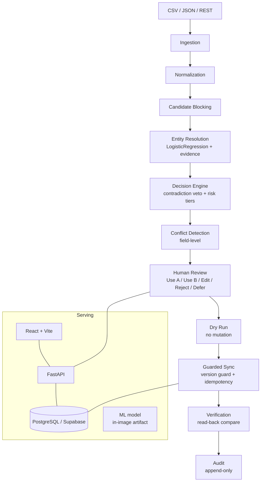

# SyncGuard — cross-system data reconciliation and synchronization reliability

**Two systems can hold records about the same entity while disagreeing about the data. Plain record matching tells you they look alike; it cannot tell you which values to trust, what a reviewer should do, or whether a write actually landed. SyncGuard is the safety layer around that gap.**

SyncGuard ingests → normalizes → generates candidates → resolves entities → detects contradictions → classifies risk → routes uncertain cases to human review → supports dry-run → performs guarded synchronization → verifies the result → records an auditable trail.



## 1. Product

Small-team data stacks reconciling customer records across two systems: upload both extracts, review likely matches with field-level evidence, resolve conflicts, dry-run the exact mutation, confirm the write to a controlled PostgreSQL target, and prove verification + audit lineage.

CORE: reconciliation, ML matching, evidence, conflict review, presence observations, human resolution, dry-run, controlled PostgreSQL sync, verification, audit.
SUPPORTING: schema drift, CSV/JSON/REST ingest.
NOT PRODUCTIZED: REST writes, golden records, lifecycle semantics, enterprise MDM/RBAC, generic observability, arbitrary SQL sync.

## 2. Core workflow

Sources → normalization → candidate blocking → ML matching → evidence → contradiction-aware decision → human review → dry-run → approved sync → verification → audit.

## 3. Engineering highlights

All verified by automated tests against real PostgreSQL, not mocks alone:

- Multi-pass candidate blocking with guardrailed block sizes and candidate recall 1.000 on real voter data.
- Contradiction-aware matching: trusted-identifier conflicts veto automatic action; thin-evidence records route to manual review.
- Explainable evidence: per-field similarities, penalties, and risk persisted with every decision — the UI renders backend truth, never frontend inference.
- Human-in-the-loop resolution with atomic claim guards and idempotent re-apply.
- Dry-run before every mutation, proven non-mutating.
- Version-guarded transactional writes with stale-write rejection.
- Target-enforced idempotent synchronization with collision protection.
- Verify-before-retry: unknown write outcomes resolve to recovered, safely-retryable, or human-gated — zero blind re-mutations, zero duplicates.
- Append-only audit trail with job-scoped traceability across match → conflict → resolution → sync → verification.
- Dockerized backend (non-root, health-checked, migration-first startup) compatible with managed PostgreSQL including Supabase.
- 385-test backend suite; production frontend builds.

## 4. Validation (honest)

- 385/385 backend tests pass; frontend production builds pass.
- Real public NC voter-registration data; temporal validation across two snapshots: MATCH recall 0.9947, zero incorrect automatic merges in tested datasets.
- Real Supabase PostgreSQL validation passed; Docker validation passed (22/22 container E2E).
- Real PostgreSQL guarded sync passed: stale-write rejection, idempotent replay, verify-before-retry, audit persistence — all green against live databases.
- Weak voter-ID labels used throughout — a stated limitation, never ground truth.
- Email/phone contradiction paths are synthetic-only (fields absent from the public data).
- 50K-scale not validated; pairwise cost guarded by `MAX_JOB_RECORDS=1000`.
- Parallel-push SQLite test flake documented (passes solo; app-DB test harness only).
- Never "accuracy": validated recall and zero incorrect automatic merges in the tested datasets.

## 5. Three-minute demo

1. Upload two source CSVs → 2. Run reconciliation → 3. Inspect match/conflict evidence → 4. Resolve a conflict (Use A) → 5. Run dry-run (target provably unchanged) → 6. Confirm the push → 7. Observe VERIFIED status and the single version-bumped mutation → 8. Push again (already-applied, no duplicate) → 9. Bump the target externally and push (stale rejection, external value preserved) → 10. Open the audit trail.

## 6. Screenshots to capture

Landing, upload, matching evidence, conflict detail, resolution with sync verification state, audit trail. (No screenshots committed yet — capture against a local run following the demo flow above.)

## 7. Model provenance

LogisticRegression matcher (`backend/app/models/febrl3_ml.pkl`, v1.0.0) trained on FEBRL3 links plus DeepMatcher-packaged Walmart-Amazon product records — product data contributed to training, so person-record behavior rests on the voter validation above, not on training-domain claims. Thresholds: MATCH 0.6, POSSIBLE 0.5 (frozen; never tuned on validation labels).

## 8. Security

Application-level API key (`API_KEY` env → `X-API-Key` header; unset means development-open, logged at startup). Production refuses placeholder `SECRET_KEY`. Source `connection_string` accepted on input, never returned by the API or logs. Parameterized SQL only; no secrets in audit metadata. This is application auth, not enterprise identity/RBAC.

## 9. Setup

```bash
python -m venv .venv && source .venv/bin/activate  # runtime verified on Python 3.9
pip install -r backend/requirements.txt
cp .env.example .env  # set DATABASE_URL, SECRET_KEY, API_KEY
alembic upgrade head  # deploy step: migrations, then boot (boot also self-creates tables)
uvicorn backend.app.main:app --reload --port 8000  # production honors $PORT (default 8000)
cd frontend && npm install && npm run dev
```

Production frontend build (backend URL baked at build time):
```bash
cd frontend && VITE_API_URL=https://<backend-host> npm run build  # serve dist/ statically
```
Development needs no VITE_API_URL (Vite proxies `/api` → localhost:8000).

Controlled PG write target (local disposable Postgres, see Phase 6B report):
`SYNCGUARD_PG_TARGET=postgresql://USER@HOST:PORT/syncguard_target`.

Production database: any standard managed PostgreSQL works through `DATABASE_URL`
(Supabase PostgreSQL is a compatible target: no extensions, no SDK, no special
pooling required — plain SQLAlchemy/psycopg2 with `pool_pre_ping`; append
`?sslmode=require` to the DSN when the provider mandates TLS). No Redis/Celery
required for the core product.

## 10. Testing

`python -m pytest backend/tests/ -q` (386 tests: matching, decisions, conflicts, presence, sync, PG connector, unknown-outcome, security, audit coverage). Frontend: `cd frontend && npm run build`. Live E2E: upload → reconciliation → conflict → resolve → dry-run → push → verify.

## 11. API

OpenAPI at `/docs`. Key endpoints: `POST /sources` (+ list/get/delete), `POST /uploads`, `POST /reconciliation`, `GET /conflicts`, `GET /conflicts/{id}` (+ resolve/reject/resolutions/audit), `GET /matches`, `POST /resolutions/{id}/dry-run|push`, `GET /sync-jobs/{id}` (+ `review` outcome block), `POST /sync-jobs/{id}/retry`, presence endpoints, `/health`, `/readyz`. Legacy `/match`, `/matching/run`, `/reconcile` are superseded (kept, not product surface).

## 12. Deployment

Local Docker validated (Phase 8C): `docker compose up postgres syncguard` —
fresh PostgreSQL → `alembic upgrade head` → backend on `$PORT` (default 8000)
→ `/health` + `/readyz` green, model loaded, full reconciliation-to-verified-sync
E2E green. Set `ENV=production`, `SECRET_KEY`, `API_KEY` (placeholders refused).
Render-compatible: `$PORT` binding, `DATABASE_URL` from environment (both
`postgresql://` and `postgres://` schemes accepted), migration-first startup.
No Redis/worker required for the core product (inline path). No public deployment
yet; Railway/Supabase/Render not connected.

## 13. Limitations

Single-tenant app-level auth only; no RBAC/SSO; no golden records; no lifecycle/deletion semantics; no bidirectional write-back or CDC; REST writes not productized; Celery presence unwired; single-county validation samples; unknown wall-clock network partitions covered by fault-injection-equivalent paths only.

## 14. Docs

Phase reports under `docs/`: product discovery/validation audits, real-data + temporal validation, 5A schema fix, 5B appearance/disappearance, 5C presence (design/implementation/wiring), 5D reviewer surfacing, 6A integration boundary, 6B PostgreSQL connector, 6C transient hardening, 6D outcome surfacing, 7 hardening, 8A–8D container/Supabase validation, release audits.

License: MIT. See `LICENSE`, `CONTRIBUTING.md`.
